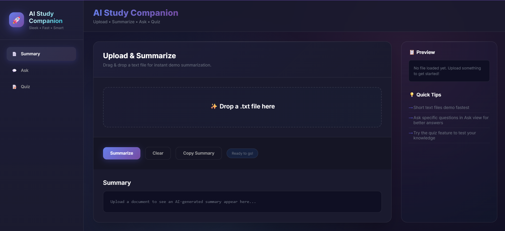
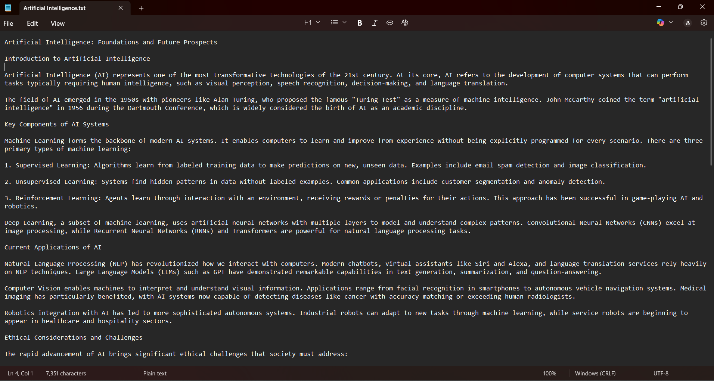
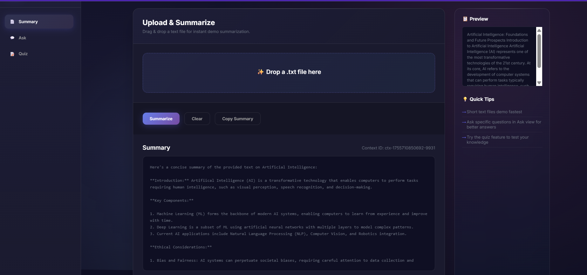
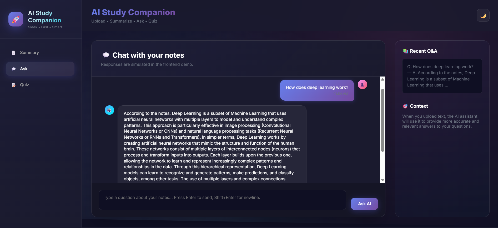
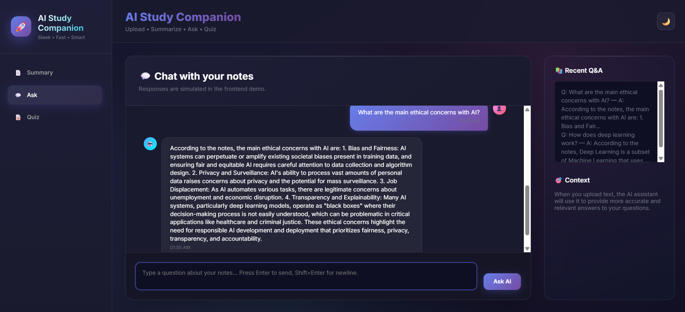
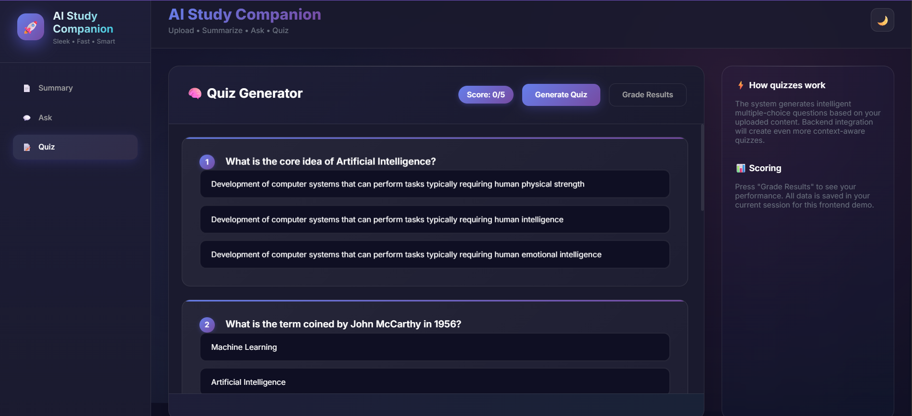
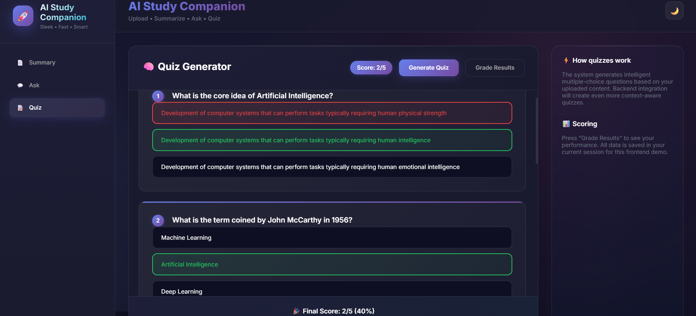

# AI Study Companion

> **Smart study assistant powered by AI** ✨  
> Upload documents, get summaries, ask questions, and take quizzes.



## 🚀 Features

- **📄 Document Upload**: Support for TXT, PDF, and DOCX files
- **🤖 AI Summaries**: Get smart summaries using Groq's LLaMA models
- **💬 Q&A Chat**: Ask questions about your uploaded content
- **🧠 Quiz Generator**: Auto-generate quizzes from your documents
- **🎨 Modern UI**: Beautiful design with dark/light themes

## 🛠️ Tech Stack

**Frontend**: Vanilla JavaScript, Modern CSS, HTML5  
**Backend**: Node.js, Express.js, Groq SDK, Multer, PDF-Parse, Mammoth

## 📋 Prerequisites

- Node.js (v14+)
- npm (v6+)
- Groq API Key ([Get one here](https://console.groq.com/))

## 🚀 Quick Start

### 1. Clone & Setup
```bash
git clone https://github.com/yourusername/ai-study-companion.git
cd ai-study-companion/Backend
npm install
```

### 2. Environment Setup
Create `.env` file in Backend folder:
```env
GROQ_API_KEY=your_groq_api_key_here
PORT=5000
```

### 3. Start Backend
```bash
npm start
# Server runs on http://localhost:5000
```

### 4. Open Frontend
Open `Frontend/index.html` in your browser or use:
```bash
cd Frontend
python -m http.server 3000
# Visit http://localhost:3000
```

## 📖 How It Works

### 1. Upload Documents


Drag and drop or click to upload TXT, PDF, or DOCX files. The system extracts text automatically.

### 2. AI Summarization


Click "Summarize" to get an AI-powered summary of your document using Groq's LLaMA models.

### 3. Ask Questions



Navigate to the "Ask" tab and chat with AI about your uploaded content. Get contextual answers instantly.

### 4. Take Quizzes



Generate multiple-choice quizzes from your content. Answer questions and get instant feedback with scoring.

## 🔧 API Endpoints

```javascript
POST /api/upload    // Upload & summarize documents
POST /api/ask       // Ask questions about content  
POST /api/quiz      // Generate quiz from content
```

## 📁 Project Structure

```
ai-study-companion/
├── Frontend/
│   └── index.html          # Main app file
├── Backend/
│   ├── .env               # Environment variables
│   ├── package.json       # Dependencies
│   └── server.js          # Express server
└── assets/images/         # Screenshots
```

## 🎯 Required Images

Add these 5 images to `assets/images/`:
- `ui-overview.png` - Main interface
- `summarization.png` - AI summary feature
- `txt-file.png` - Document upload
- `ask.png` - Q&A chat
- `quiz.png` - Quiz interface

## 🤝 Contributing

1. Fork the repository
2. Create feature branch (`git checkout -b feature/new-feature`)
3. Commit changes (`git commit -m 'Add new feature'`)
4. Push to branch (`git push origin feature/new-feature`)
5. Open Pull Request

## 📄 License

MIT License - see [LICENSE](LICENSE) file for details.

## 👨‍💻 Author

**Fuad Rahman Biswas**
- GitHub: [@fuadrahmanbiswas](https://github.com/fuad-rahman-biswas)

---

<div align="center">

**⭐ Star this repo if you find it helpful!**

**Made with ❤️ and lots of ☕**

</div>
